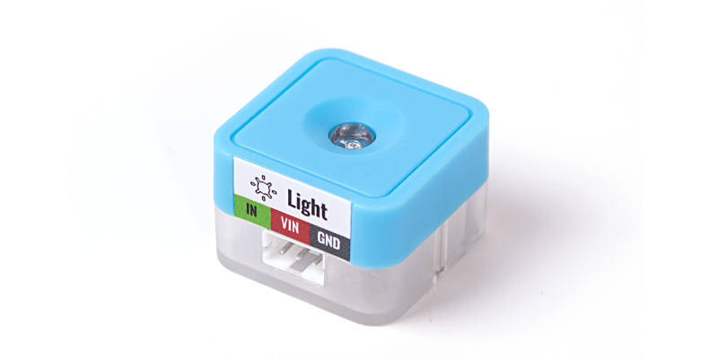
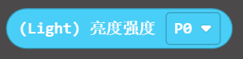
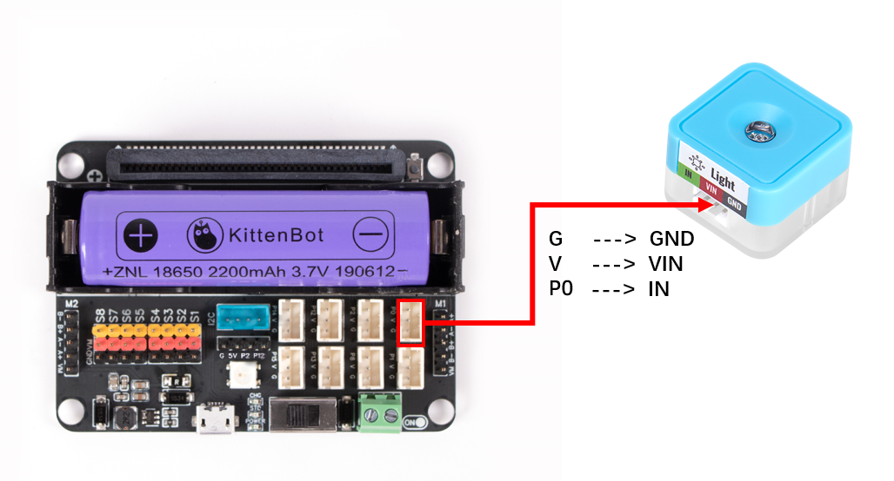
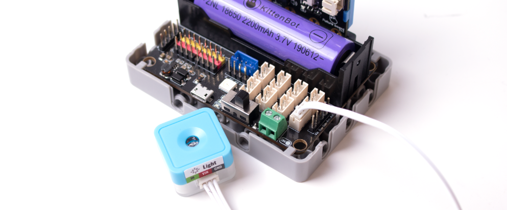
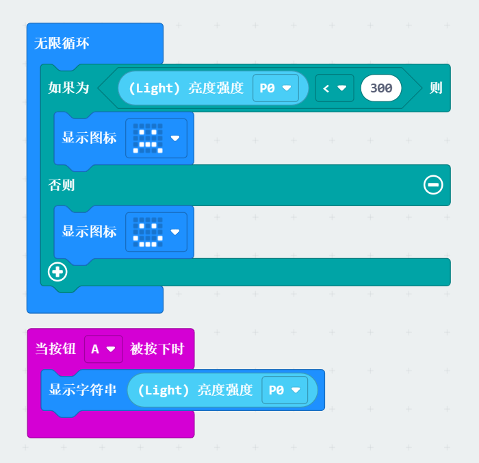
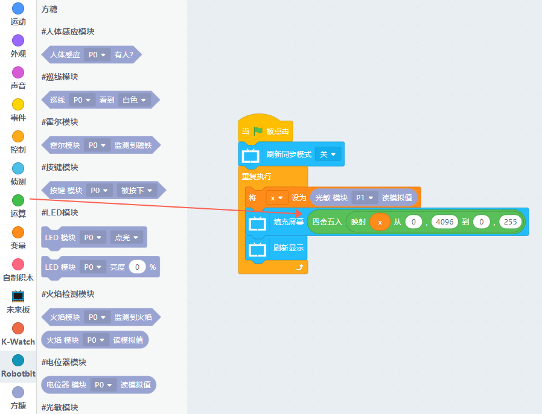


## Introduction
Detect the ambient light intensity and return the analog data.<br />


## Parameters
---
| **Dimension** | 24 x 24 x 16 mm |
| --- | --- |
| **Weight** | 4.7 g |
| **Signal** | Analog input |
| **Range** | 0~3.3V **correspond to future board** 0~4095 |


## Using on micro:bit



##   Coding Platform
[Microsoft MakeCode for micro:bit](https://makecode.microbit.org/#editor)<br />Use Makecode as coding platform


##   Add Sugar Plugin

<br />Search Sugar in extensions, click add


## Building Blocks - Function Description
| Serial Number | Building Block Image | Building Block Function |
| --- | --- | --- |
| 1 |  | Get the numerical value of the light-sensitive sensor (0-1023) |


## Circuit Connection

|  |  | Microbit Interface | Wiring | <br /> |
| --- | --- | --- | --- | --- |
|  | Light Sensor | P0 | White PH2.0-3Pin Interface Wire |  |
---
Connect the light sensor to the P1 of Robotbit Edu using a 3PIN terminal wire.<br />Turn on the Robotbit power supply to see the red light at the bottom of the light sensor module light up (indicating that the module is powered normally)<br />


## Case: Determine Light Intensity



##   Coding
---


##    Using Kittenblock
The brightness of the future board screen is filled with the screen, and the filled value is the lightness value 0~255(from black to white). If the ambient light value 0~4095 is to correspond to the screen brightness value 0~255, the mapping block needs to be used to correspond the two intervals one by one.
Choose to run the program in the online running or offline uploading mode to see the effect
:::info
If you are not sure how to run online or upload offline, please refer to [**Quick Start**](https://www.yuque.com/kittenbot/hardwares/eytesg#PBHya)
:::



## Ambient Light Value
`value()`
- Return value: 0~4095
```python
from future import *
from sugar import *
light = Light('P1')
```


## Interval mapping formula, no need to understand too much, just use it directly
def valmap(x, in_min, in_max, out_min, out_max):
    return int((x-in_min) * (out_max-out_min) / (in_max-in_min) + out_min)


## Turn off synchronous refresh for smoother screen
screen.sync = 0
while True:
    x = light.value()
    screen.fill(round(valmap(x, 0, 4096, 0, 255)))
    screen.refresh()


## Effect Demonstration
Realize the brightness of the ambient light, and the brightness of the face board screen will change accordingly.
[](https://www.yuque.com/kittenbot/hardwares/sugar-light?_lake_card=%7B%22status%22%3A%22done%22%2C%22name%22%3A%22light.mp4%22%2C%22size%22%3A%22665171%22%2C%22taskId%22%3A%22u7d655d9f-2db1-41d1-b6b7-892b2e06983%22%2C%22taskType%22%3A%22upload%22%2C%22url%22%3Anull%2C%22cover%22%3Anull%2C%22videoId%22%3A%22inputs%2Fprod%2Fyuque%2F2021%2F1432972%2Fmp4%2F1623394578932-920a422e-d378-4c55-a2fb-aa22fd953358.mp4%22%2C%22download%22%3Afalse%2C%22__spacing%22%3A%22both%22%2C%22id%22%3A%22IjPp4%22%2C%22margin%22%3A%7B%22top%22%3Atrue%2C%22bottom%22%3Atrue%7D%2C%22card%22%3A%22video%22%7D#IjPp4)

