
## Introduction



##   Feature
---
| **Signal** | Time-Series Signal |
| --- | --- |
|  |


## Module Principle
The colored LED lamp bead has a lamp controller directly built-in, in addition to the 3-color LED. This is called the IC lamp bead. You only need to input a 24-bit RGB control signal, and it will automatically generate a drive pwm signal internally. It also has built-in signal forwarding. For continuous input signals, after intercepting the first 24 bits, the following data is automatically forwarded from the DOUT port to the next lamp bead.


##   Coding Blocks


## Building Blocks - Function Description
| ID | Building Block Image | Building Block Function |
| --- | --- | --- |
| 1 |  | Colorful lights initialization settings. You can choose the 3 RGBs on board or the light ring of other interfaces. External light rings generally use 8 RGBs |
| 2 |  | Synthesize color display by customizing three colors |
| 3 |  | Set the brightness of RGB colorful lights, 0-100 |
| 4 |  | Control the color of the colorful light with the specified serial number. The serial number starts from 1. Refresh display needs to be added later to take effect |
| 5 |  | Customize the values of the three color lamp beads inside the lamp bead to control the color of the colorful light |
| 6 |  |   Control the display color of all colorful lights. It can take effect without adding refresh display  |
| 7 |  | Turn off the light with the specified serial number, and refresh the display later to take effect |
| 8 |  | Control the display color of all colorful lights. It can take effect without adding refresh display |
| 9 |  | Control all colorful lights to turn off, and it can take effect without adding refresh display |
| 10 |  | Make the colorful light display take effect |
| 11 |  | Set the overall effect of all lights |
| ID | Building Block Image | Building Block Function |
| --- | --- | --- |
| 1 |  | Initialize pins and number of lights |
| 2 |  | Take a range of LEDs |
| 3 |  | The whole light strip displays rainbow effect |
| 4 |  | The whole light strip displays one color |
| 5 |  | The whole light strip, as a whole, displays columnar, suitable for music spectrum |
| 6 |  | Display needs to take effect when controlling a small number of lights |
| 7 |  | Clear display |
| 8 |  | Customize LED display |
| 9 |  | Overall movement |
| 10 |  | Overall movement (loop), head and tail loop |
| 11 |  | Control a single LED. The light starts from the serial number of 0 as the first one |
| 12 |  | Control the brightness of the light strip |
| 13 |  | Customize the value of LED color |


## Cases
---


##   Brightness Control - Breathing Light
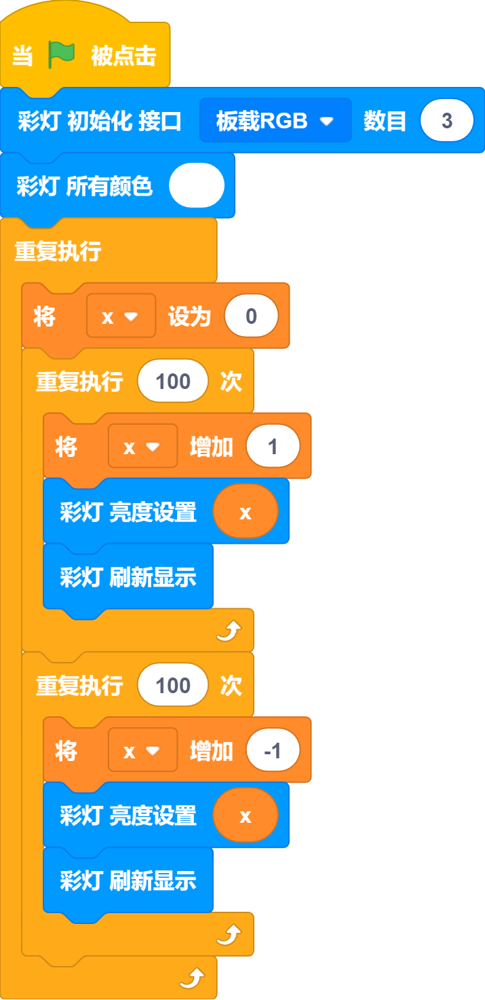


##   Sequence Control - Flowing Light
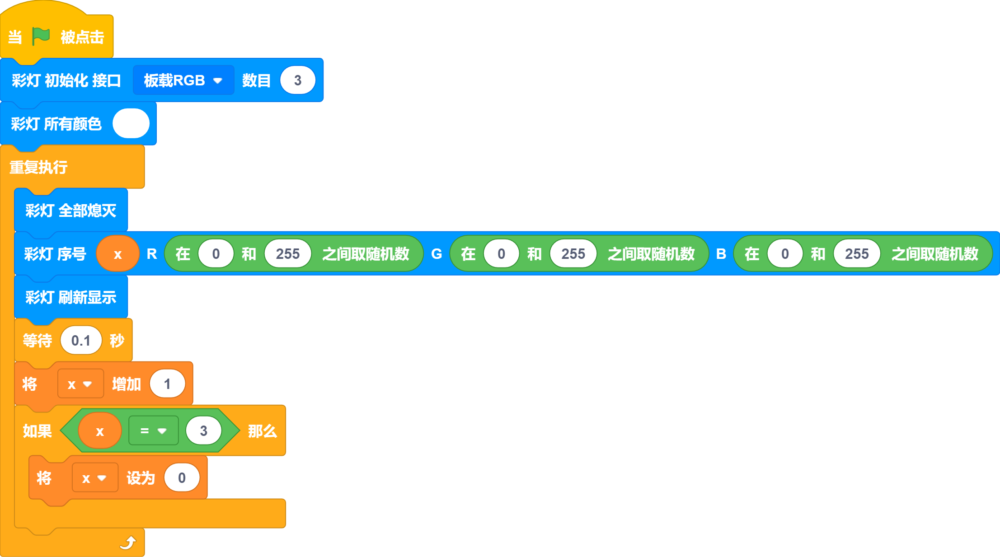


## View the preset effect
📑: It is recommended that you use the online mode and click directly to view the preset effect. It is convenient and quick. 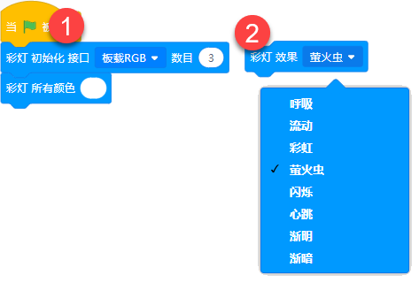


## Integrated Case-Induction Lamp

 The intelligent induction device is used to control the lighting of the campus (classroom/basement/library). Taking the campus street lamp as a demonstration, when someone approaches, the street lamp will light up, and the street lamp will turn off after the person leaves.


##    Structure construction
[School lighting.pdf](https://www.yuque.com/attachments/yuque/0/2024/pdf/488591/1707031389821-2a345d68-b541-4a04-816a-bf0d63abf84d.pdf)


##    Circuit Connection

|  |  | Future Board Lite Interface | Wire |   |
| --- | --- | --- | --- | --- |
|  | RGB light ring | Port1 | White PH2.0-3Pin interface cable |  |
|  | Ultrasonic ranging module | Port3 | White PH2.0-3Pin interface cable |  |


## Plugin Loading - Ultrasound Plugin
 



## Building Block Usage——Main Building Block
|  |  |  |
| --- | --- | --- |
| 1 |  | Initialize RGB light settings, you can choose the RGB at the interface, or you can choose the 3 RGBs onboard |
| 2 |  | Adjust RGB light strip |
| 3 |  | Control all RGB lights |
| 4 |  | Turn off all RGB lights |
| 5 |  | Read the distance value of the ultrasonic module | To learn more about the usage of RGB, click to view [06-Color Light](https://www.yuque.com/kittenbot/hardwares/pbn1ctqmq3z9whn2?view=doc_embed)


## Main program - ultrasonic judgment
:::info
Using ultrasound for distance judgment, and RGB light control
:::



## Using On Microbit



## Coding Platform
[Microsoft MakeCode for micro:bit](https://makecode.microbit.org/#editor)
 Use Makecode coding platform


##   Add plug-in

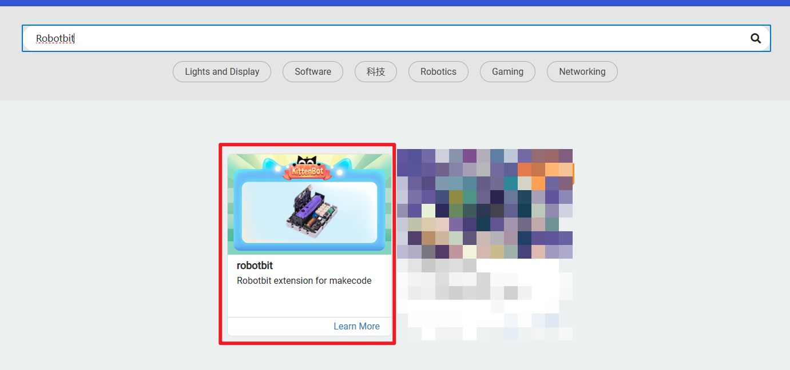 Search for Robotbit in the extension, click add 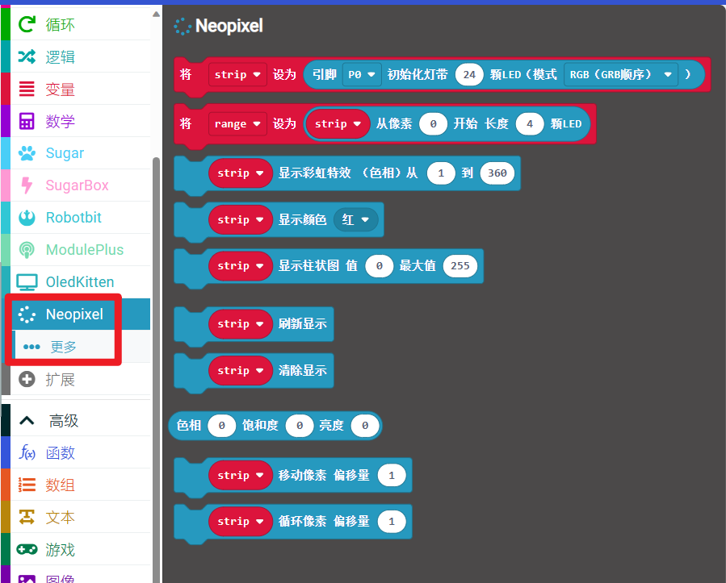


## Circuit Connection
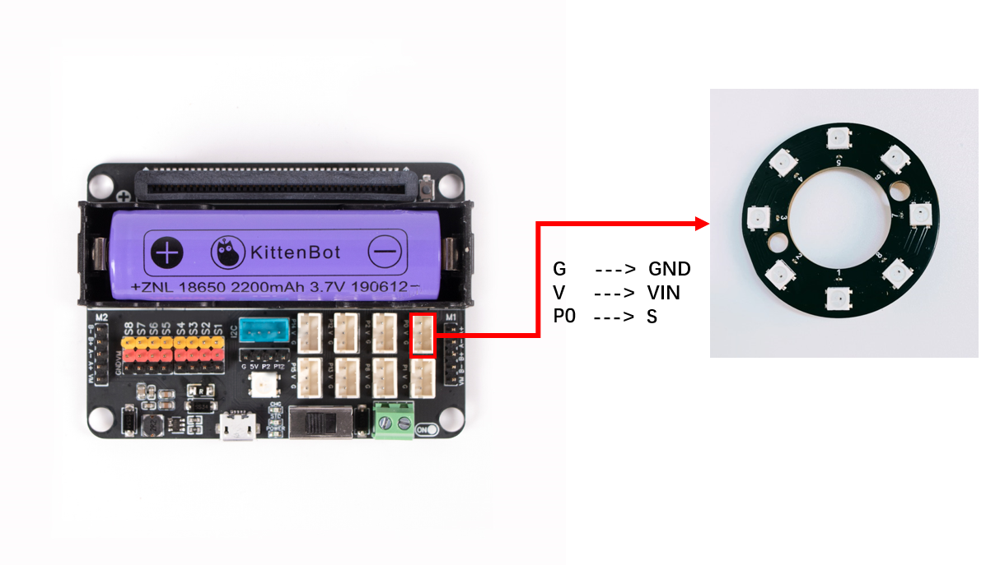
|  |  | Microbit Interface | Cable Used |   |
| --- | --- | --- | --- | --- |
|  | RGB Light Ring | P0 | White PH2.0-3Pin Interface Cable |  |


## Case 1: Controlling a single light

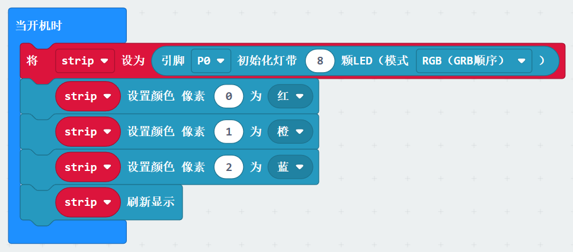


## Case 2: Rainbow Effect
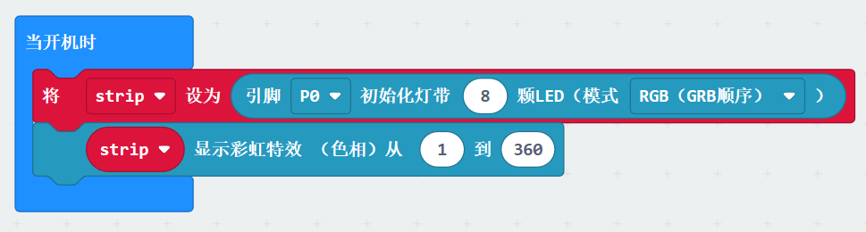


## Case 3: Overall Colour Control
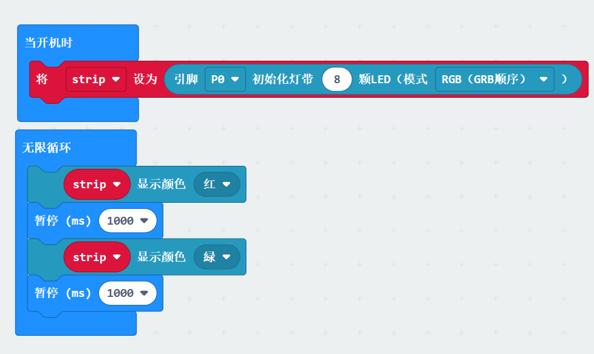


## Case 4: Display column charts
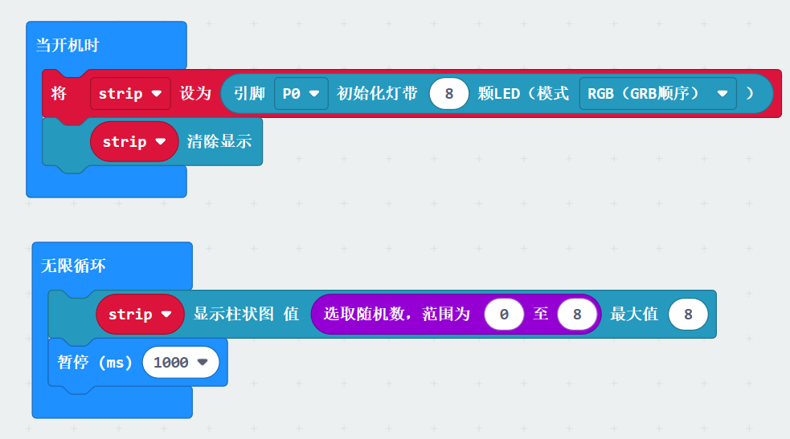


## Example 5: Display mobile
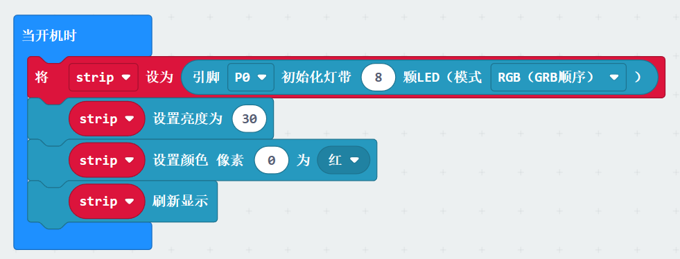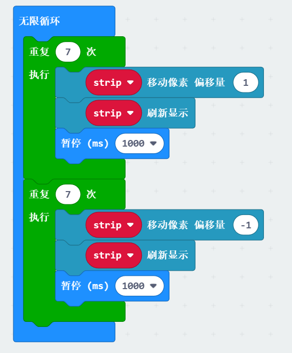


## Case 6: Pixel Cycle Moving
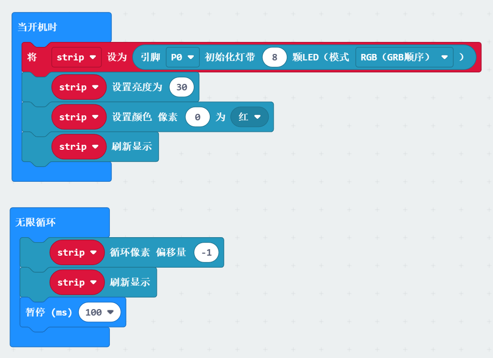


## Case 7: Customize color
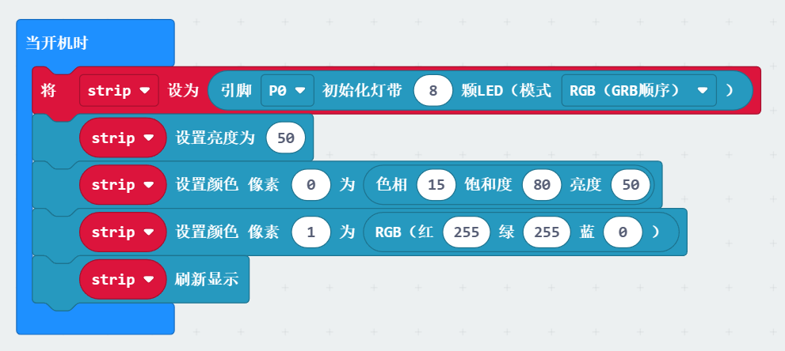

