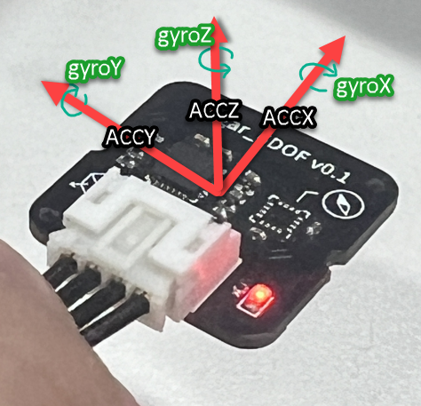
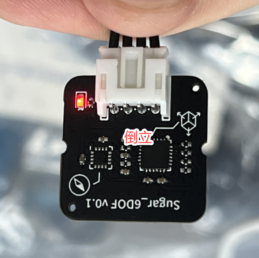
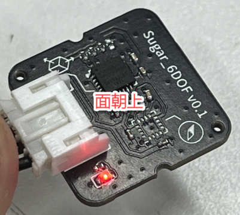
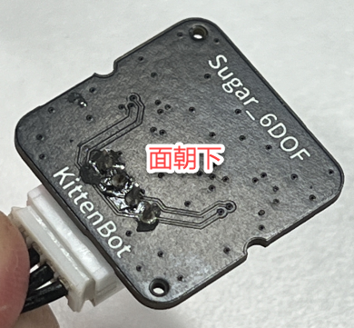
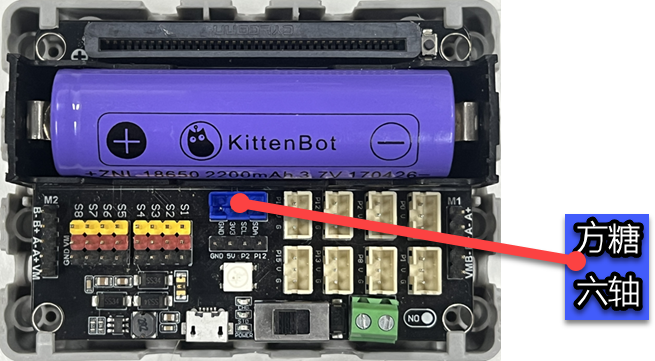


## Introduction
The MPU6050 is a common Inertial Measurement Unit (IMU) that combines a 3-axis accelerometer and a 3-axis gyroscope, allowing you to measure a device's acceleration, angular velocity, and orientation.


## Building Block Introduction
|  | Update gyroscope data |
| --- | --- |
|  | Detect preset posture |
|  | Get accelerometer raw data |
|  | Get gyroscope raw data |
|  | Get roll angle or tilt angle (degree) |


## About the Pose
  


## Using on Future Board
- Add Extension 
- Line Connection  
- Test Program 

