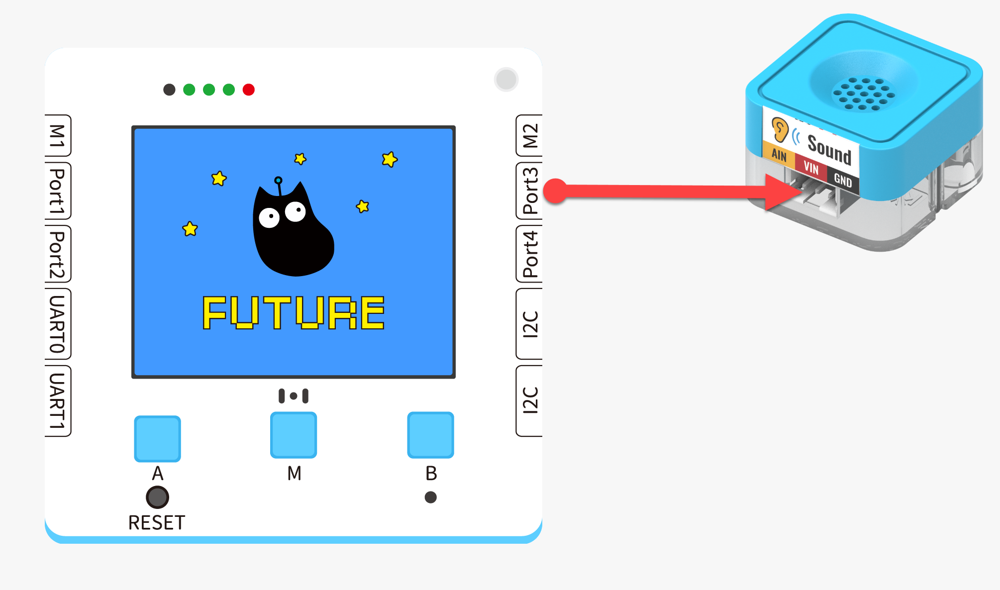
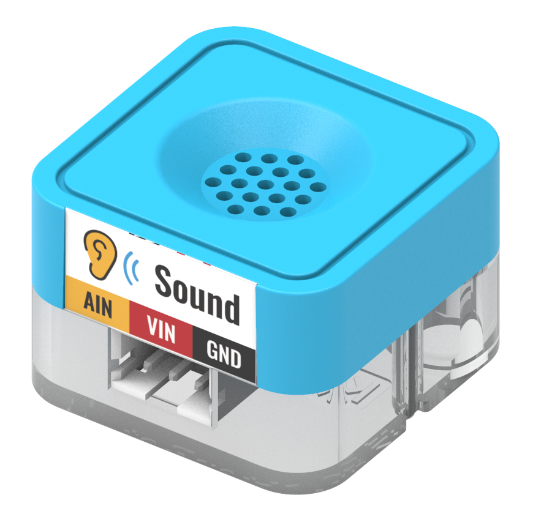
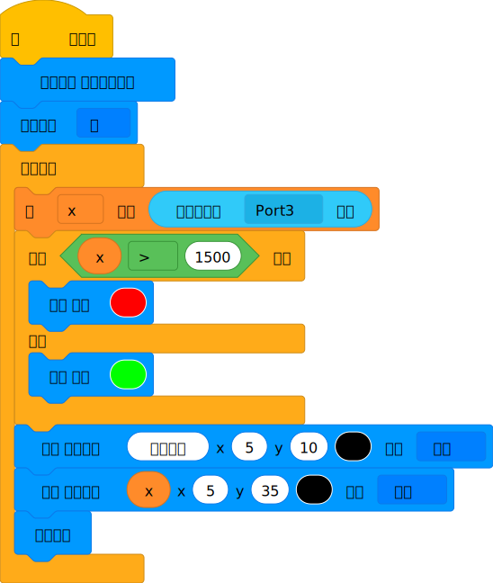
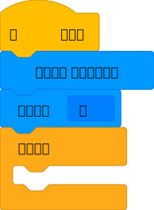
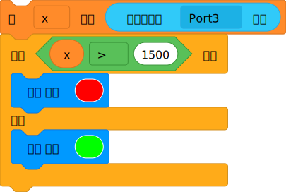
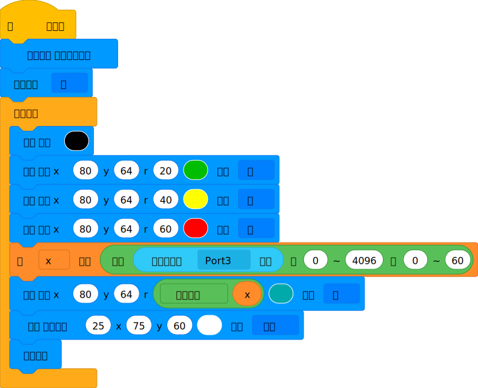
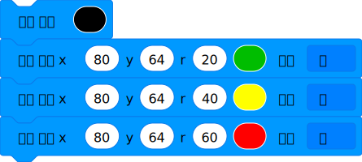
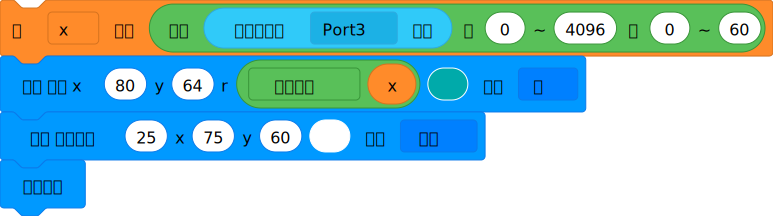


##  Functions
---
| **Signal** | Analog output 0~3.3V **Corresponding to the Future Board Lite**0~4096 |
| --- | --- |
|  |


## Module Principle
The sound sensor works based on the principle of piezoelectricity. When a sound wave hits the surface of the sensor, the piezoelectric material inside the sensor generates a tiny charge change, which can be measured and converted into a digital signal. In addition, the sound sensor also requires a pre-amplifier to amplify the charge change signal and filter out other types of interference signals.


## Wiring

|  |  | Futublock Lite Interface | Cable |   |
| --- | --- | --- | --- | --- |
|  | Sugar Cube Sound Sensor Module | Port3 | White PH2.0-3Pin Interface Cable |  |
:::warning
Support connecting to Port1, Port2, Port3, Port4 Pay attention to the consistency of interface and actual situation when programming
:::


## Blocks - Function Description
| No. | Block Image | Block Function |
| --- | --- | --- |
| 1 |  | Reads the output value of the module, range 0-4096, the louder the sound, the greater the value |
| 2 |  | Converts value, mapping method is output=100x(60-0)/(4096-0) |


## Block 1 - Full program



## Block 1 - Function Description
:::info
Set the color screen to full color pixel mode, and turn off the auto refresh mode.  
:::
:::warning
Read the value of sound sensor, and set a threshold, when the value is over the threshold, the screen displays red, otherwise displays green.  The threshold can be modified according to the actual situation.  
:::
:::tips
Display the value of sound sensor on the color screen.  
:::


## Program 2 - Complete Program



## Block 2 - Functions Explained
:::warning
Set the display to full color pixel mode and turn off auto refresh mode. 
:::
:::success
Draw three concentric circles that represent three levels of sound. 
:::
> Convert the value from the sound sensor to a value that can be displayed as the radius of a circle on the screen.
> - How mapping works
> 
For example, if the value of x is between 0 and 4096. Our display can't show a rectangle with a height of 4096 pixels, but it can show a rectangle with a maximum height of 100 pixels. We can use mapping to convert the value to a smaller number.
> Let's say the current reading from the raindrop water level sensor is X = 2000.
> Using the mapping parameters in the diagram, we get = 2000x((60-0)/(4096-0))=29.296
> Since the display variable does not support displaying decimals directly, we convert it to an integer.
> 
> 


##   Using Kittenblock
Run the program offline to view the effect


## Using on Microbit



##   Programming Platform
[Microsoft MakeCode for micro:bit](https://makecode.microbit.org/#editor) Programming with MakeCode platform


## Add the Sugar plugin

  Search Sugar in the extensions, click Add

