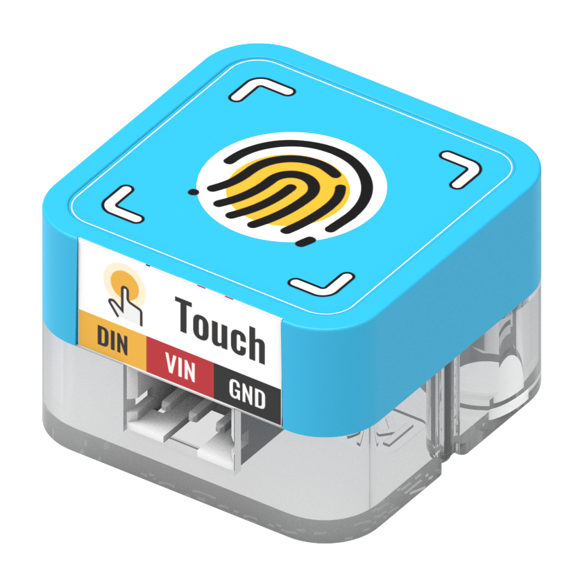
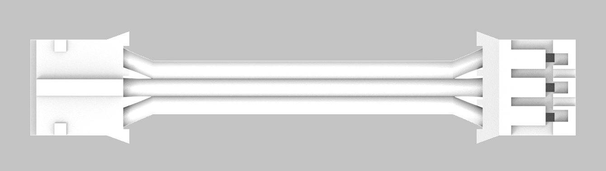

## Features

---

| **Signal** | Digital output 1 (high level): touch module is pressed 0 (low level): touch module is not pressed |
| ---------------- | ----------------------------------------------------------------------------------------------------------- |
|                  |                                                                                                             |

## Module Principle

The module contains a built-in touch detection chip that touches the housing via a spring, implementing the touch effect of a finger in close proximity

## Wiring

|                                                              |                    | Future Board Lite Interface | Cable                            |                                                              |
| ------------------------------------------------------------ | ------------------ | --------------------------- | -------------------------------- | ------------------------------------------------------------ |
|  | Sugar Touch Module | Port3                       | White PH2.0-3Pin Interface Cable |  |

warning          

Can be connected to Port1, Port2, Port3, Port4          

When programming, make sure the interface is consistent with the actual one.

## Blocks - Function Description

| No.  | Block Image                                                  | Block Function                             |
| ---- | ------------------------------------------------------------ | ------------------------------------------ |
| 1    |  | Detect whether the touch sensor is pressed |

## Program-Full program

## Program - Function Description

:::success

1. Set the color screen to dot matrix mode
2. Initialize the variable, which is responsible for recording the number of times the touch sensor is pressed
3. Loop detection
4. When the touch sensor is detected as being pressed
5. Display a smiling face image once, increase X, and then display X on the dot matrix screen
6. When the touch sensor is not detected as being pressed, the dot matrix screen displays a crying face

## Use Kittenblock

Run the program offline to see the effect

## Using Robotbit on Microbit

## Programming Platform

[Microsoft MakeCode for micro:bit](https://makecode.microbit.org/#editor)

Programming with Makecode Platform

## Add Sugar Plugin

Search for Sugar in extensions, click Add

## Circuit Connection

|                                                              |                    | Microbit Interface | Wire                            |                                                              |
| ------------------------------------------------------------ | ------------------ | ------------------ | ------------------------------- | ------------------------------------------------------------ |
|  | Sugar Touch Module | P0                 | White PH2.0-3Pin Interface Wire |  |

warning         

 Support connecting to P0, P1, P13, etc. When programming, pay attention to keep the interface consistent with the actual.

## Blocks - Function Description

| No.  | Block Image                                                  | Block Function                           |
| ---- | ------------------------------------------------------------ | ---------------------------------------- |
| 1    |  | Read whether the touch module is touched |

## Case: Touch Detection

