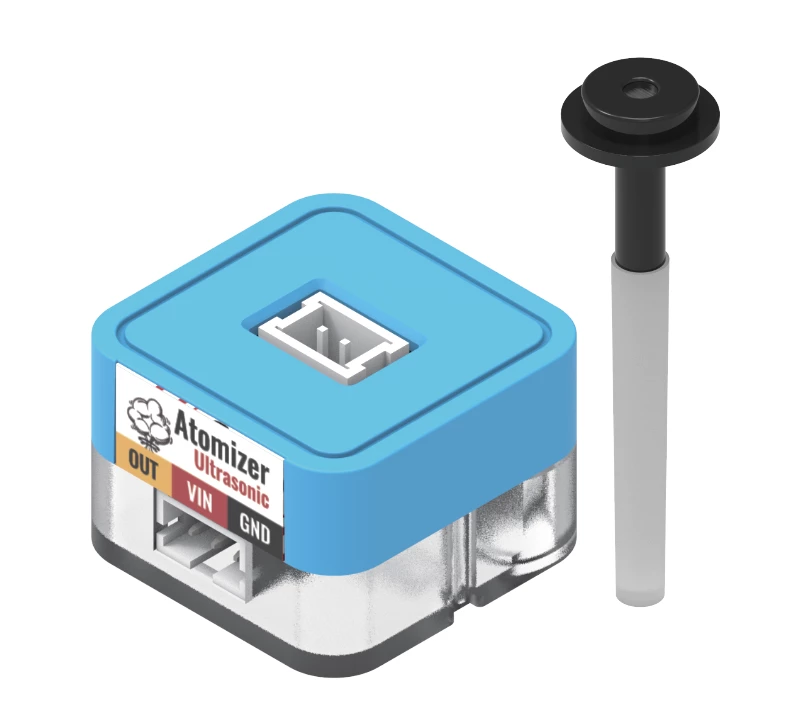
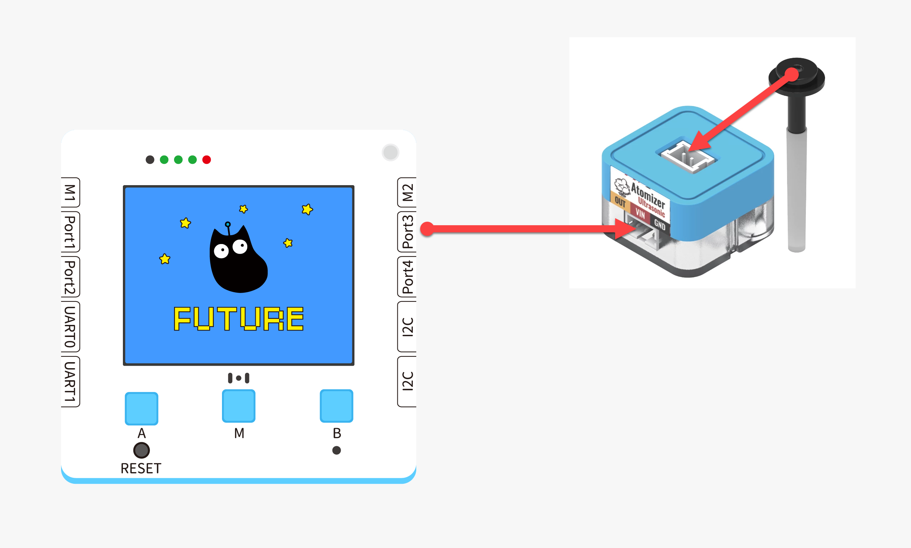
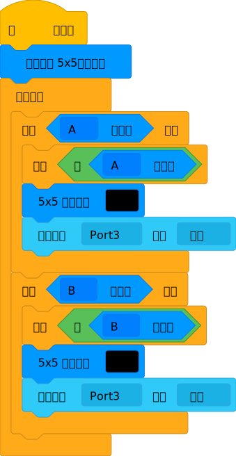
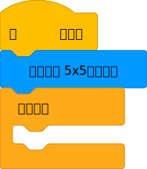
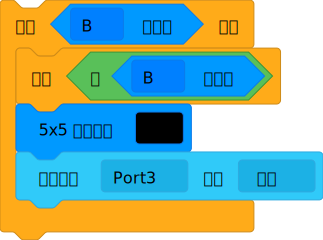
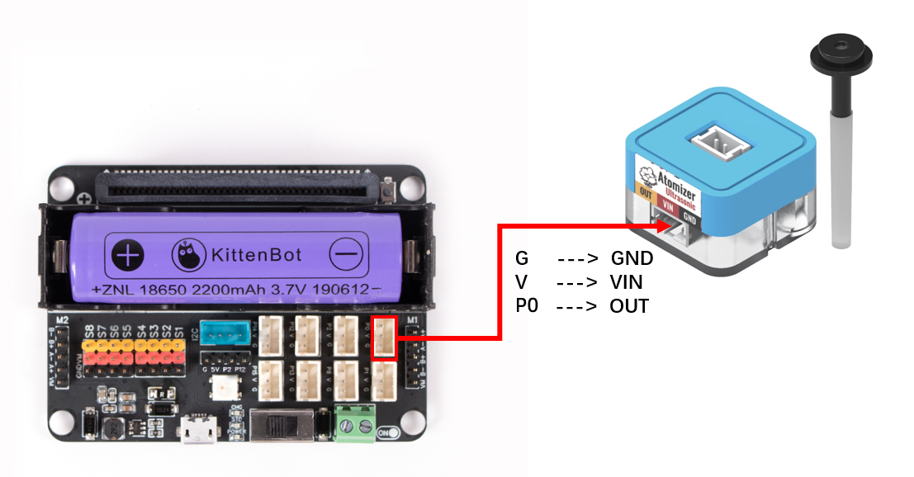
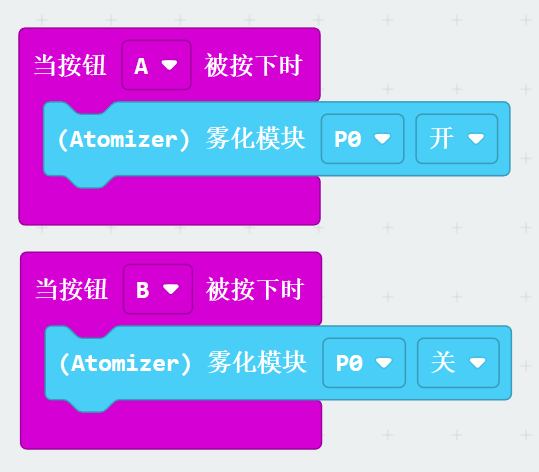


## Introduction



##   Function
---
Convert water to mist to increase humidity
| **Signal** | Digital input  1 (High level): Turn on the humidifier  0 (Low level): Turn off the humidifier |
| --- | --- |
|  |


##   Module principle
Ultrasonic atomizer uses electronic high-frequency oscillation (oscillation frequency is 1.7MHz or 2.4MHz, which is beyond the hearing range of human beings. This electronic oscillation is harmless to human beings and animals). Through the high-frequency resonance of the ceramic atomizing sheet, the liquid water molecular structure is broken up to produce natural and elegant water mist, without heating or adding any chemical reagents. Compared with the heating atomization method, energy is saved by 90%. In addition, a large number of negative ions will be released during the atomization process, which will produce electrostatic reaction with smoke, dust, etc. floating in the air, making them precipitate, and can also effectively remove harmful substances such as formaldehyde, carbon monoxide, and bacteria, so as to purify the air and reduce the occurrence of diseases.


## Wiring

|  |  | Future Board Lite Interface | Wire |  |
| --- | --- | --- | --- | --- |
|  | Sugar Cube Ultrasonic Atomization Module | Port3 | White PH2.0-3Pin Interface Wire |  |
:::warning
Supports connecting to Port1, Port2, Port3, Port4 Pay attention that the interface is consistent with the actual when programming.
:::


## Building Block - Function Description
| Sequence | Building Block Image | Building Block Function |
| --- | --- | --- |
| 1 |  | Control the switch of the external atomization module |
| 2 |  | Invert the program state |
| Sequence | Building Block Image | Building Block Function |
| --- | --- | --- |
| 1 |  | Control the switch of the atomization module |


## Program - Full Program



## Program - Function description
:::info
Set the color screen to dot matrix mode 
:::
:::success
If press key A on Maqueen Lite, wait for release, display icon, open atomization module 
:::
:::warning
If press key B on Maqueen Lite, wait for release, display icon, close atomization module 
:::


## Using Kittenblock
Run the program offline to check the effect


## Usage on Microbit



##   Coding platforms
[Microsoft MakeCode for micro:bit](https://makecode.microbit.org/#editor) Using Makecode coding platform


## Add Sugar plug-in

 Search Sugar in the extension, click to add


## Circuit Connection

|  |  | Microbit Interface | Wire |   |
| --- | --- | --- | --- | --- |
|  | Sugar Ultrasonic Fogging Module | P0 | White PH2.0-3Pin Interface Wire |  |
:::warning
Support connecting to P0, P1, P2, P8, etc. When programming, make sure the interface matches the actual one.
:::


## Case: Button Control


