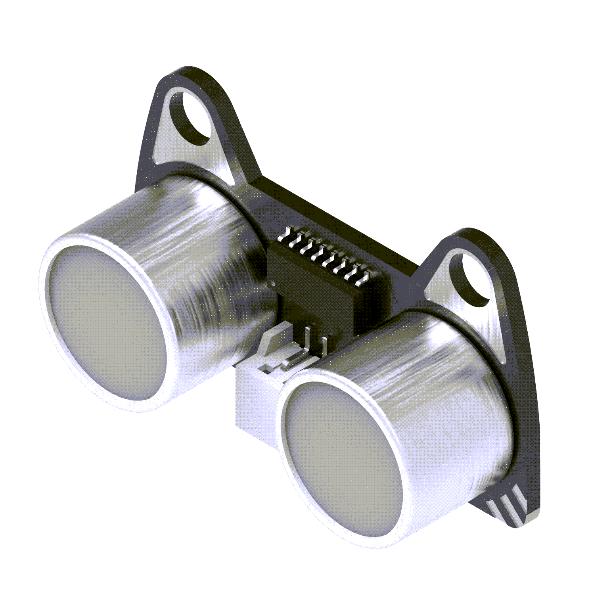
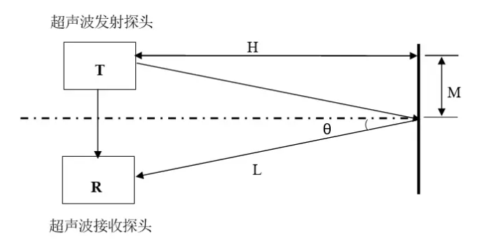
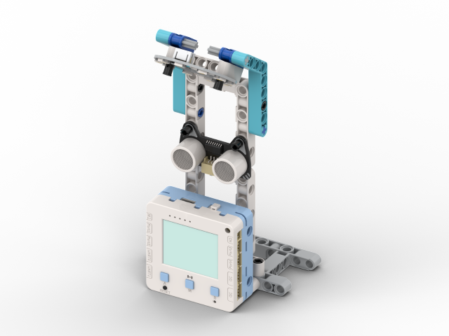
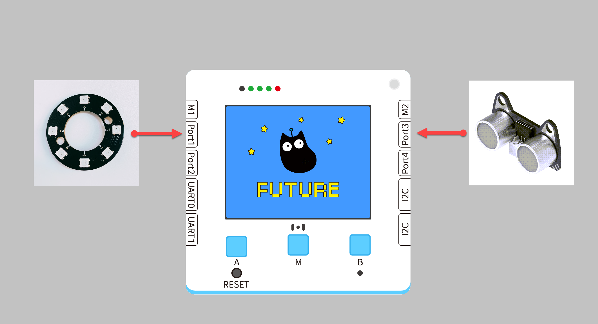
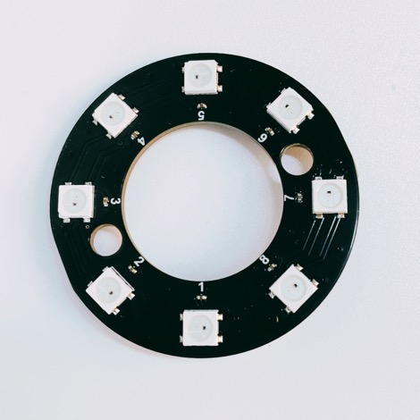
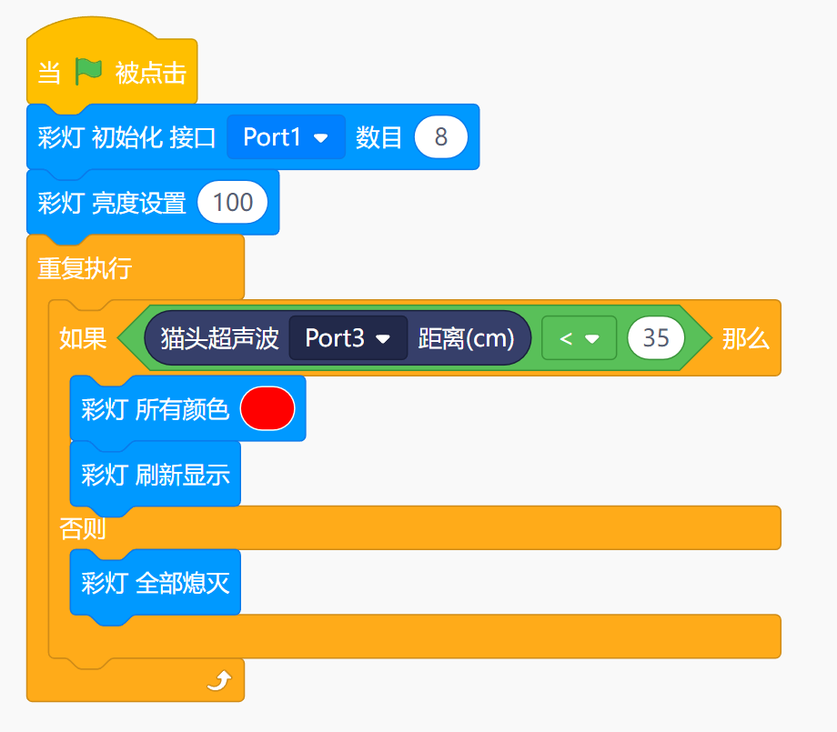
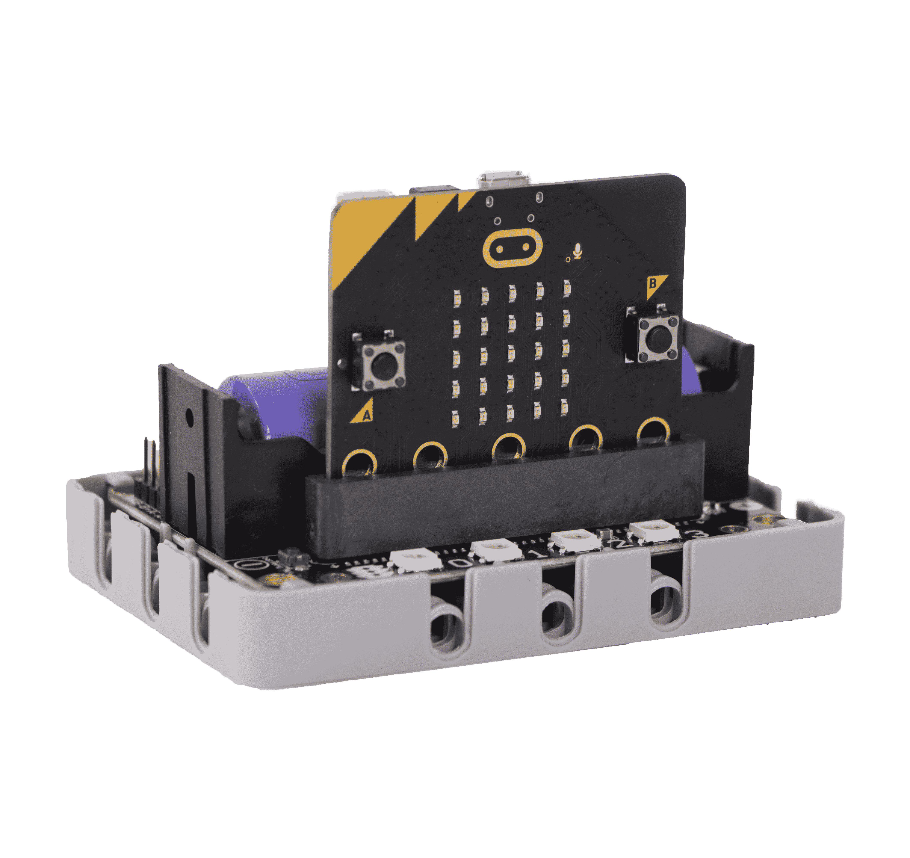


## Introduction



##   Function
---
Judge the distance between obstacles ahead and the module by transmitting and receiving sound waves.
| **Signal** | Timing signal |
| --- | --- |
|  |


## Working Principle of the Module
Sound waves with frequencies higher than 20 kHz are called ultrasonic waves, which feature good directivity and penetration capability, especially in water, where they can propagate over longer distances. To facilitate the study and utilization of ultrasonic waves, people have designed many types of ultrasonic generators, which vary in the way they generate ultrasonic waves, ranging from electrical to mechanical methods, and therefore have different applications. Each type of generator has its own application scenarios, but at present, the most widely used type is the piezoelectric ultrasonic generator. The key component of a piezoelectric ultrasonic generator is the piezoelectric chip inside, which mainly utilizes the resonance of the piezoelectric chip to work. There are two piezoelectric chips and a resonant plate inside the generator. When a pulse signal is applied between the two electrodes of the generator, the piezoelectric chip will vibrate when the frequency of the applied signal is equal to the frequency of the piezoelectric chip, and it will also drive the resonant plate to vibrate. This will generate ultrasonic waves, which is the transmitting end of the ultrasonic generator. However, if there is no applied pulse signal between the two electrodes of the generator and the resonant plate receives the transmitted ultrasonic waves, the piezoelectric chip will be forced to vibrate, and the mechanical energy generated will be converted into an electrical signal. This is the receiving end of the ultrasonic generator. 


## **Ultrasonic Distance Measurement Principle**

The principle of ultrasonic distance measurement is very simple. An ultrasonic transmitter emits a beam of ultrasonic waves. The timer starts when the ultrasonic waves are emitted, and the emitted ultrasonic waves propagate through the medium. Sound waves have the property of reflection, and when they encounter an obstacle, they reflect back. When the ultrasonic receiver receives the reflected ultrasonic waves, the timer stops. When the medium is air, the speed of sound is 340m/s. Based on the recorded time t, the distance between the transmitting position and the obstacle can be calculated using the formula **s=340*t/2**.


## Usage in Future Board Lite
 With the intelligent sensing device, you can control lighting in school areas (classrooms/basements/libraries). Using the school street lamp as a demonstration, the street lamp will light up when someone comes close, and turn off after the person leaves.


## **Structure building**
[Campus lighting.pdf](https://www.yuque.com/attachments/yuque/0/2024/pdf/488591/1706860548681-cb1e06cf-6439-43b7-92a7-9bf4b30c6c25.pdf)


##    Circuit Connection

|  |  | Future Board Lite Interface | Wire in Use |   |
| --- | --- | --- | --- | --- |
|  | RGB Light Ring | Port1 | White PH2.0-3Pin Interface Wire |  |
|  | Ultrasonic Distance Measuring Module | Port3 | White PH2.0-3Pin Interface Wire |  |


## Plugin Loading - Ultrasonic Plugin
 



## Building Block Usage - Main Building Block
|  |  |  |
| --- | --- | --- |
| 1 |  | Initialize RGB light settings, can choose RGB at the interface, can choose 3 RGBs on board |
| 2 |  | RGB light strip adjustment |
| 3 |  | Control all RGB lights |
| 4 |  | Turn off all RGB lights |
| 5 |  | Read the distance value of the ultrasonic module | For more detailed usage of RGB, click to view [06-Colorful Lights](https://www.yuque.com/kittenbot/hardwares/pbn1ctqmq3z9whn2?view=doc_embed)


## Main Program - Ultrasonic Ranging
:::info
Using ultrasonic for distance measurement and controlling RGB lights
:::



## Use on Microbit



##   Programming Platform
[Microsoft MakeCode for micro:bit](https://makecode.microbit.org/#editor) Use the Makecode program platform


##   Adding the Sugar plugin

  
  

Search for Sugar in the extensions, and click Add


## Building Block - Function Description
| Serial Number | Block Diagram | Block Function |
| --- | --- | --- |
| 1 |  | Obtain the distance of obstacles in front of the ultrasonic module (supports mm and cm) |


##  Circuit connection

|  |  | Microbit Interface | Wiring |   |
| --- | --- | --- | --- | --- |
|  | Ultrasonic ranging module | P1 | White PH2.0-3Pin interface cable |  |


##   Case: Distance Measurement
 

