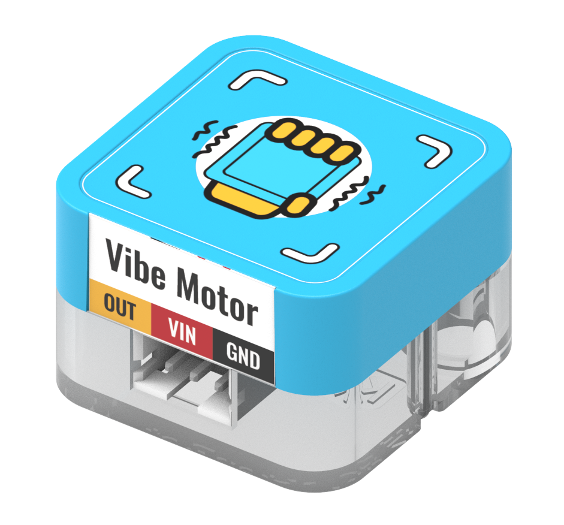
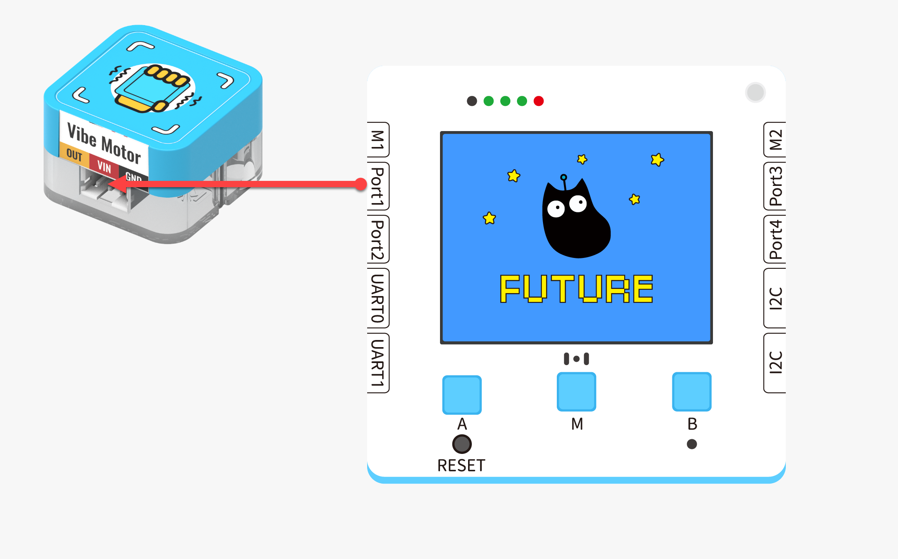
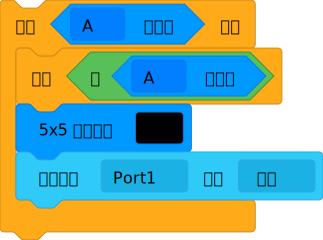
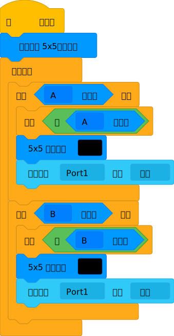
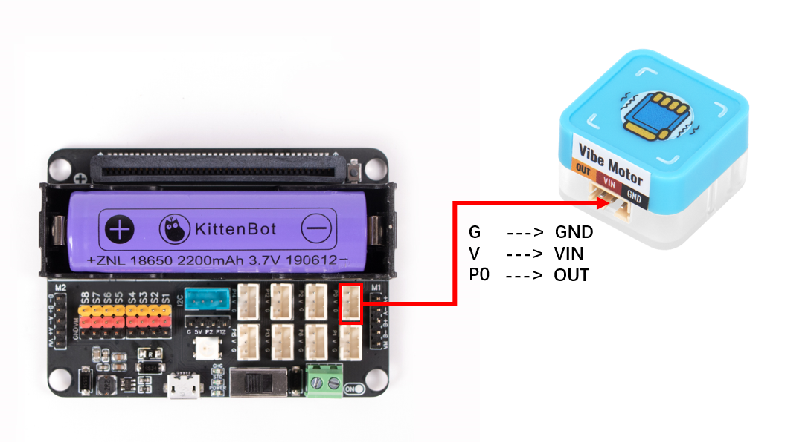
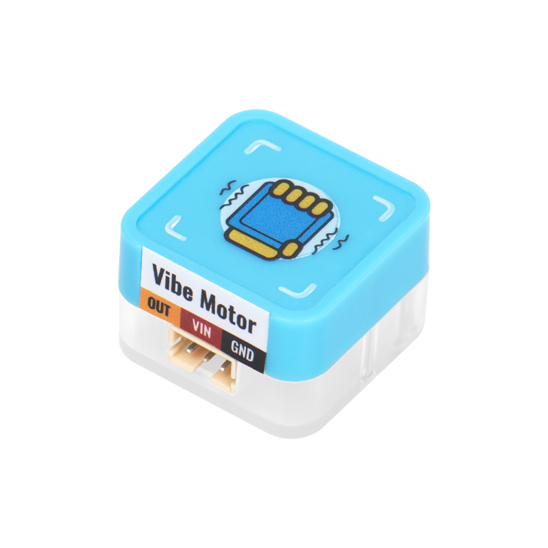
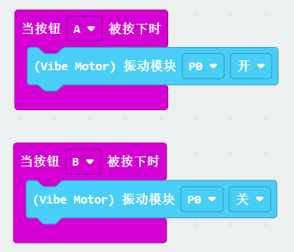


## Introduction



## Features
---
Controls motor rotation to achieve a vibration effect, similar to the principle of a mobile phone vibration motor
| **Signal** | Digital input 1 (high level): Turn on vibration 0 (low level): Turn off vibration |
| --- | --- |
|  |


##   Module Principle
There is a motor inside, the axis of rotation of the motor is not symmetrically centered, which will result in the effect of overall vibration


## Wiring

|  |  | Future_Board_Lite_Interface | Wire |   |
| --- | --- | --- | --- | --- |
|  | Sugar Vibration Module | Port1 | White PH2.0-3Pin Interface Wire |  |
:::warning
Supports connection to Port1、Port2、Port3、Port4 Pay attention to the consistency between the interface and the actual interface during programming
:::


## Block Function Description
| No. | Block Image | Block Function |
| --- | --- | --- |
| 1 |  | Control the switch of vibration module |
| 2 |  | Invert the result |
| 3 |  | Judge whether the onboard button of Future Board Lite is pressed |
| 4 |  | Wait for execution |
| No. | Block Image | Block Function |
| --- | --- | --- |
| 1 |  | Control the switch of vibration module |


## Program - Function Description
:::info
 After pressing the button, wait for the button to be released and then start the vibration module
:::


## Program - Full program



## Effect
:::warning
Press the A button to turn on the vibration module Press the B button to turn off the vibration module
:::


## Use Kittenblock
Use the app to download and run programs offline to view results


## Using on Microbit



##   Programming Platform
[Microsoft MakeCode for micro:bit](https://makecode.microbit.org/#editor) Use Makecode programming platform


##   Add the Sugar plugin

 Search for Sugar in the extensions, click add


## Circuit connection

| | | Microbit port | Wire |   |
| --- | --- | --- | --- | --- |
|  | Sugar vibration module | P0 | White PH2.0-3Pin interface wire |  |


## Case: Button control


