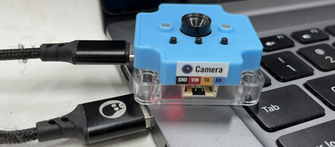
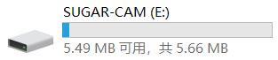
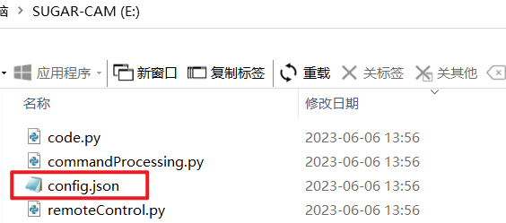
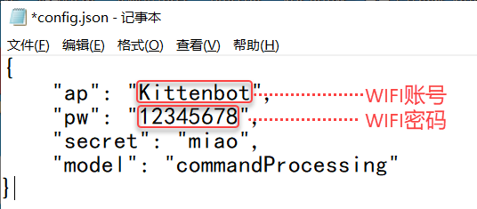
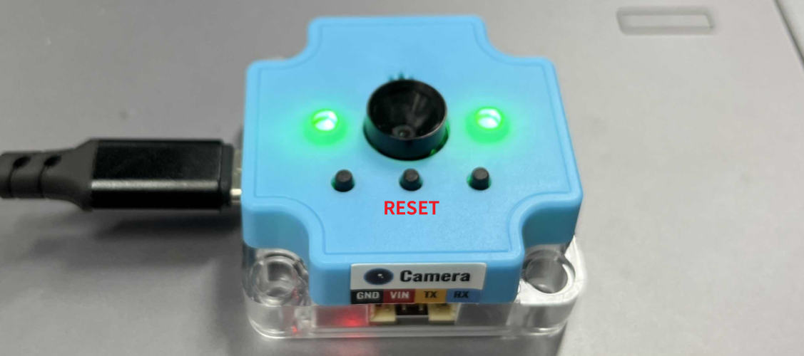
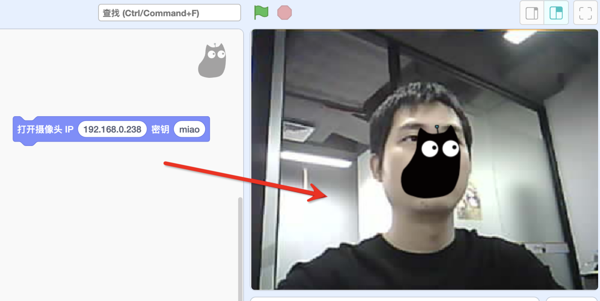

### Quick Start
The first time you use the Sugar camera, you need to set the WIFI account and password for the module first, to facilitate the subsequent wireless connection.

1. Use a USB cable to connect the camera module to the computer

2. The USB stick of SUGAR-CAM appears on the computer. Go to the disc drive and double-click to open the disc drive in the`config.json`

3. Change to your own WIFI account and password (remember to save changes)
:::warning
The module only supports 2.4G band routers, if you can't connect, try mobile phone transmitting WIFI hotspot
:::

- ap：WIFI account
- pw：WIFI password
- secret：Be sure to fill in the key that is required for the software to connect to the wireless camera.
- model：The mode will be expanded in detail in the next section, so don't change the default he
- 

4. After completing the configuration modification of config.json (remember to save it), unplug the USB cable again or press the RESET button in the middle of the module to reset.
:::info
If the WIFI connection is successful, it lights green; if it fails, it lights red. If it fails double check the following points:

- Whether the WIFI signal is 2.4G band, does not support 5G
- Whether the account and password are filled in incorrectly
:::

### Connecting the Sugar Camera

1. Open [Kittenblock 1.89.17](http://www.kittenbot.cn/kittenblock) and above, and load the `Sugar Camera` in the extension, which functions as a WIFI camera

2. Find the Sugar Camera IP address

Need to install software on your computer for Camera IP lookup:.

- Windows computer install this [ip scanner](https://www.advanced-ip-scanner.com/cn/)https://www.advanced-ip-scanner.com/cn/)
- Install LanScan on a mac computer (search for LanScan in the APP Store)

In the software, it shows the corresponding IP of the manufacturer as `Espressif Inc`, which is the IP of your camera (192.168.0.135 as shown in the picture), please remember your own IP!

3. Fill in the IP address of your Camera and click on the blocks to bring up the camera screen on the stage. At this point, you have put the Camera to successful use.

   
