# SumoBot 12-in-1 Kit

SumoBot 12-in-1 Kit

SumoBot 12-in-1 Kit is a competitive play set designed for BBC Micro:bit.

Through building and programming different models, students can engage in competitive games and simultaneously increase their interests in coding and engineering.

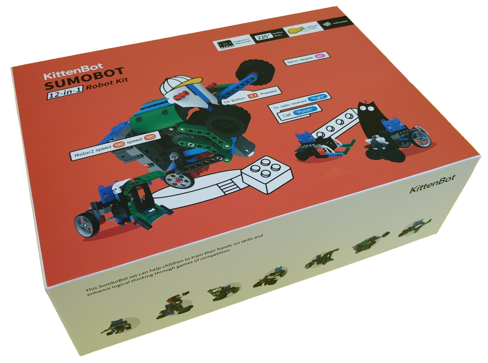

## Contents
- Micro:bit（Optional）x1
- Micro:bit Silicone sleeve x1
- Robotbit v2.2 x1
- Robotbit Case x1
- Five-way Line-following Sensor x1
- KittenBot Ultrasonic Sensor x1
- KittenBot PCB Button Module x2
- Geekservo 9g Red Motor x2
- Geekservo 9g Grey Servo x1
- 18650 Li-ion Battery x1
- 65mm  Rubber wheels x2
- KittenBot 1m microUSB x1
- DuPont Wire 20P
- Building Bricks 1 pack

## Features

- Learning by playing

- Allows easy expansion via building bricks

- Easy-to-pick-up programming

- Easy-to-build models

- Designed for Micro:bit

- Compatible with other Kittenbot products

## Demonstration Video

## Models

### 1. SumoBot

Attack the opponent using the robot's horn and push it out of the arena, or enter defensive mode to protect your robot from attacks.

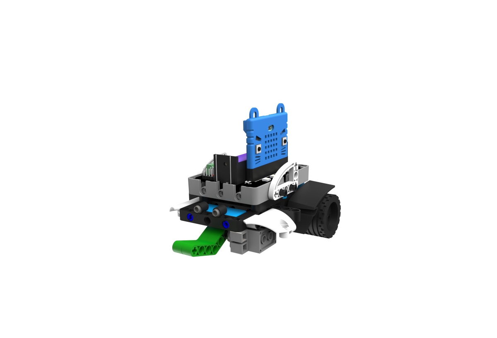

### 2. Flag Swiper

Use the arm to swipe down the flags on the opponent.

### 3. RoboPusher

Make use of its agility to retrieve important resources from the arena.

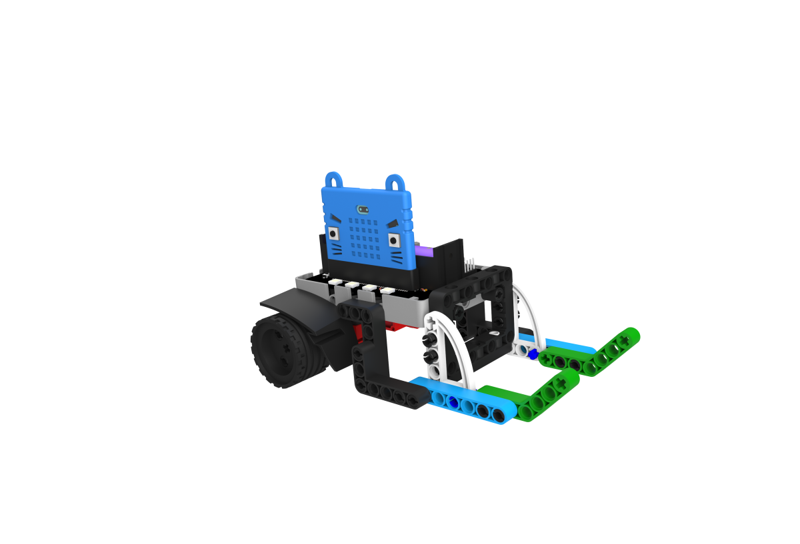

### 4. Punching Mantis

Use the fists to knock down the opponent.

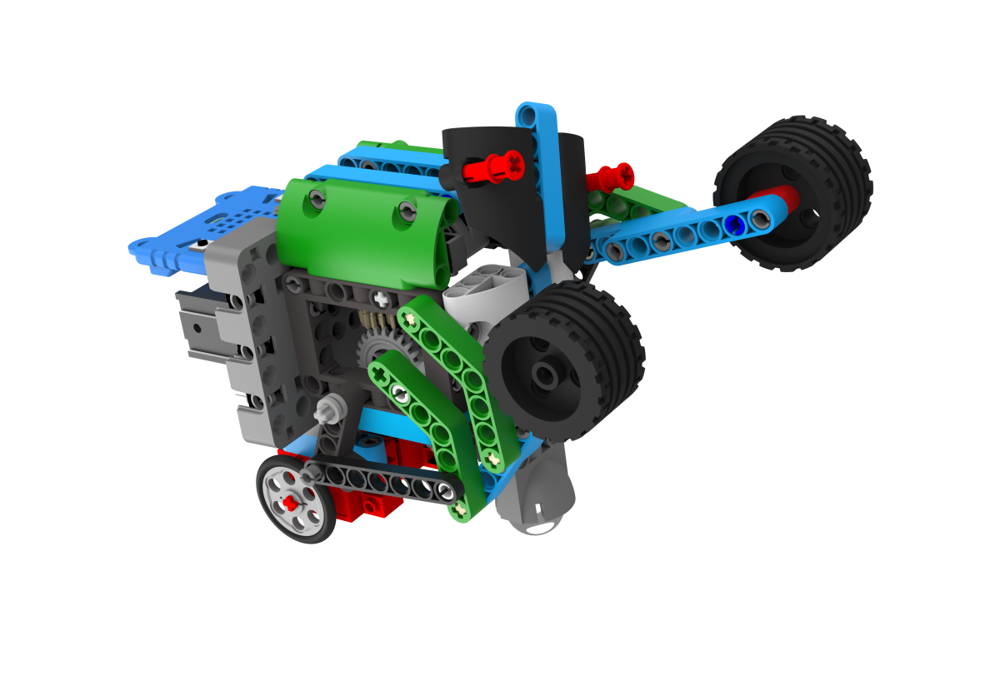

### 5. RoboCatcher

Use the shield to protect the resources from the oppoents, it can also avoid obstacles automatically.

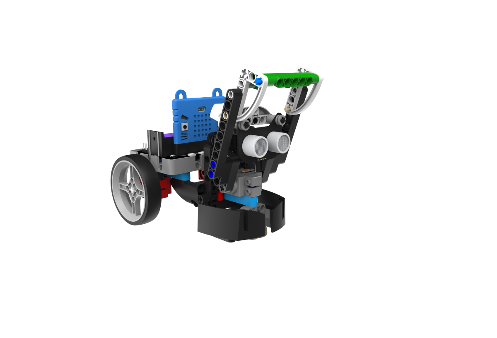

### 6. RoboDino

Use the horn to damage the opponent.

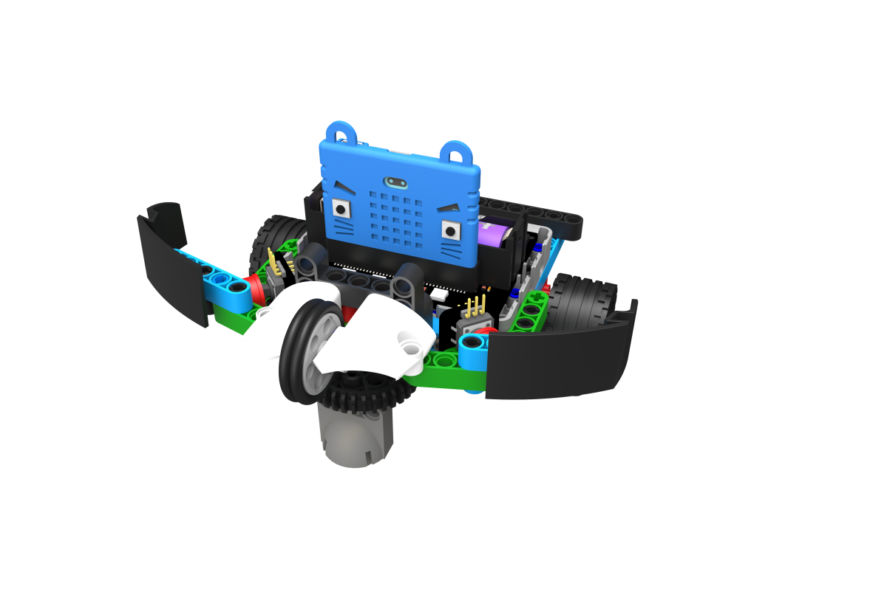

### 7. Sumo Wrestler

Use its huge body and pushing power to push the opponent out of the arena.

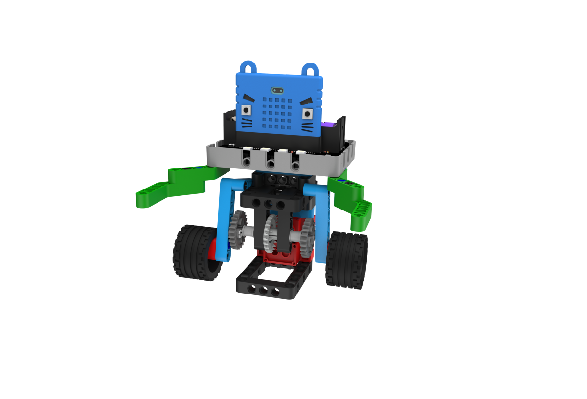

### 8. RoboFootballer

Use its agility to score by kicking the football into the goal.

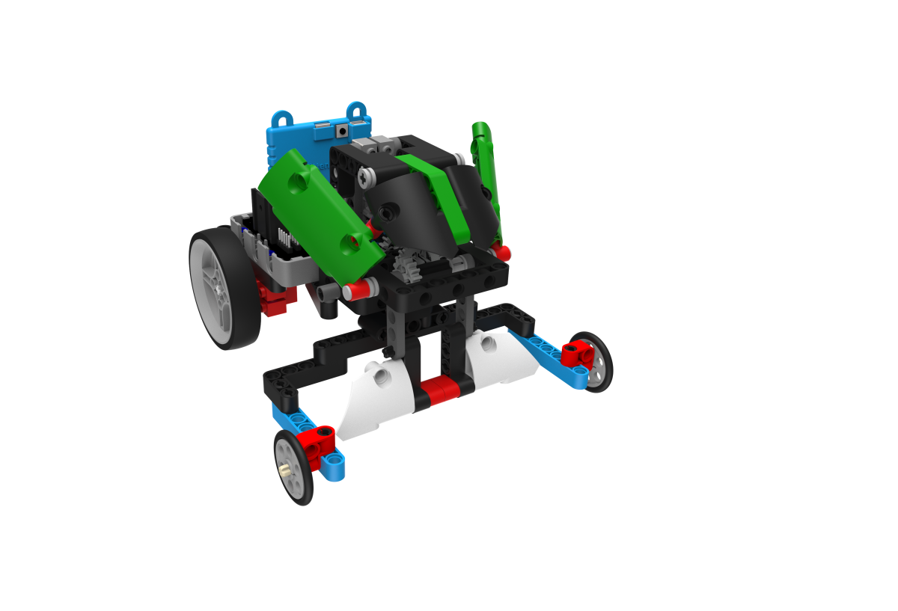

### 9. RoadBlock Smasher

Use the big jaws to build roadblocks in the arena and clear the roadblocks built by the opponent.

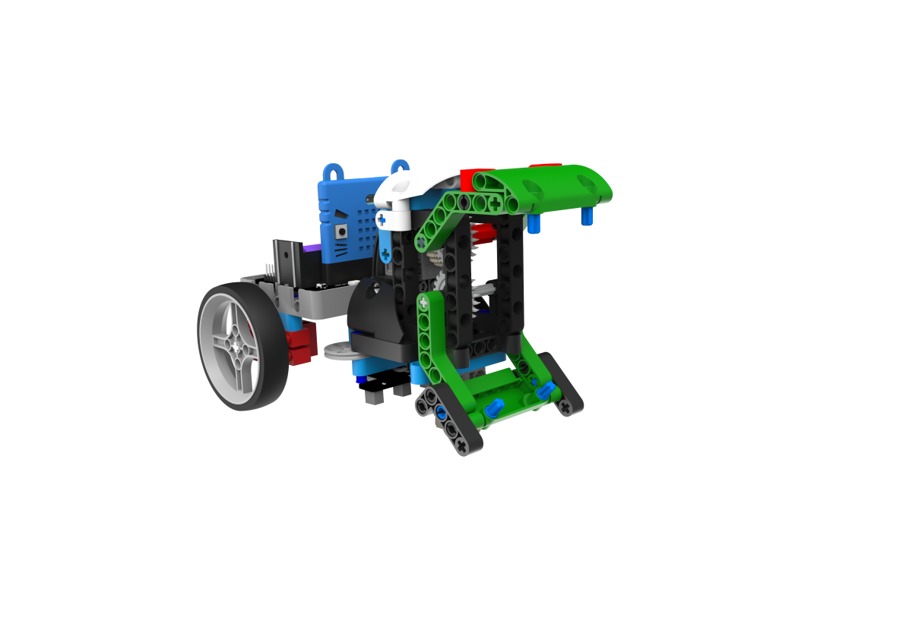

### 10. Speed Racer

This is a robot designed for speed, use your skills to beat the other racers.

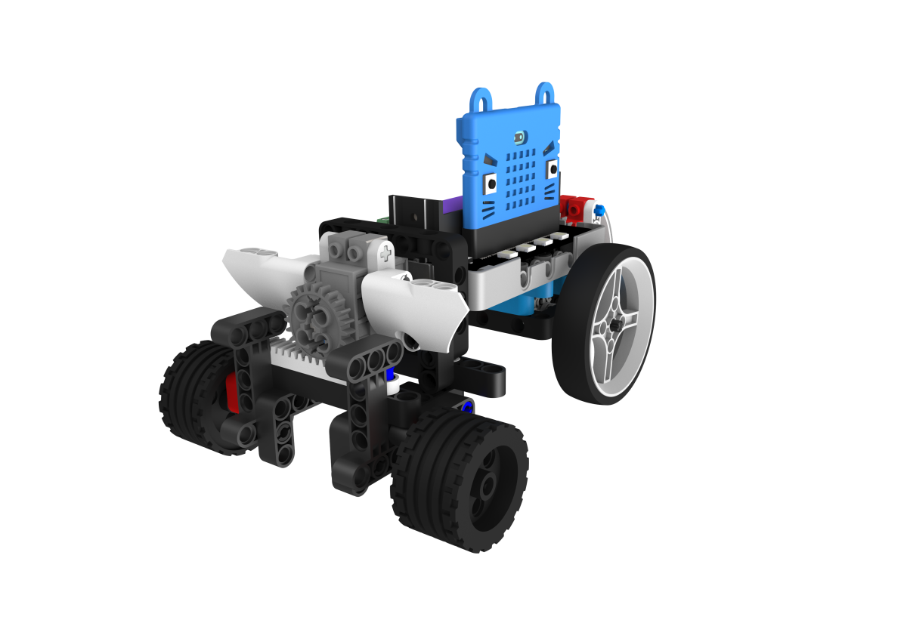

### 11. Battle Turret

A robot capable of long-range artillery, aim and shoot the rubberband to knock the opponents.

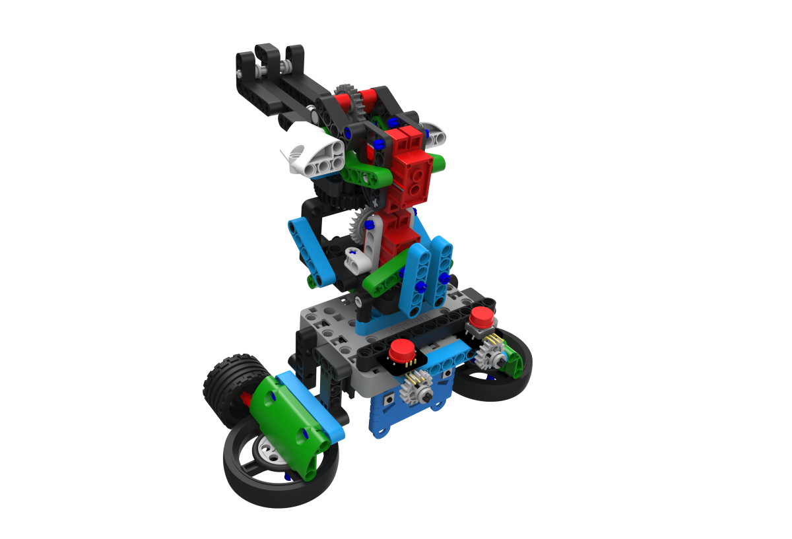

### 12. Smart Toilet Tissue Machine

Gives you toilet tissue automatically.

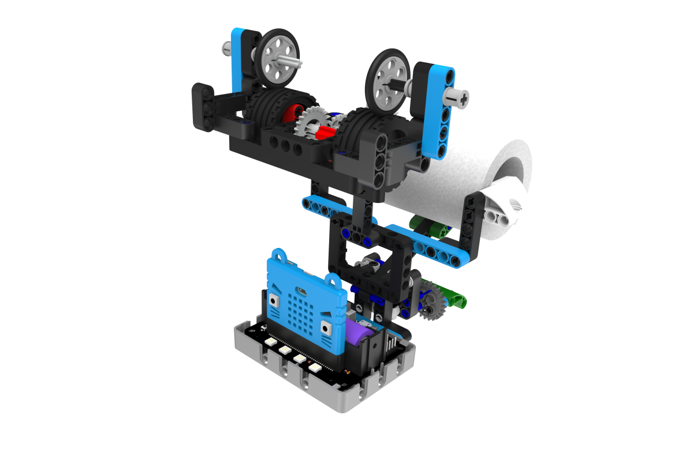
